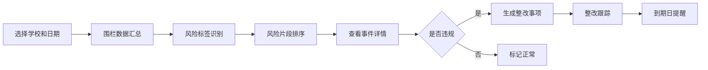
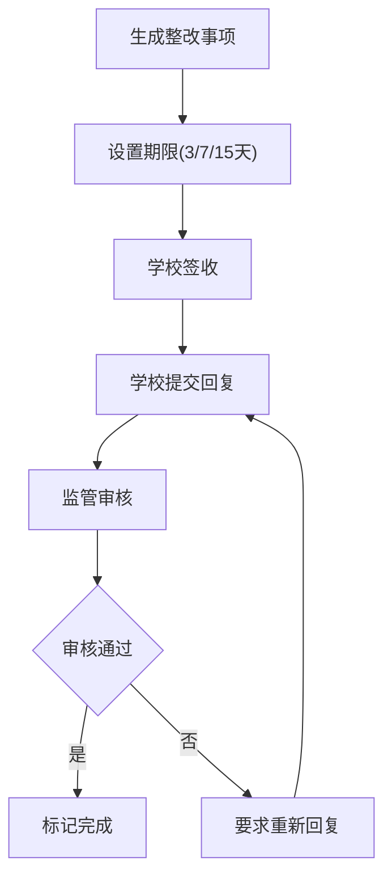

## 1. 产品概述

面向县区教育局校车监管科的桌面端电子围栏执行抽查工具，通过数据化手段监管校车是否真正遵守电子围栏规定，提升监管效率，保障学生上下学安全。

- **核心问题**：电子围栏系统虽已安装，但缺乏有效抽查手段，监管人员无法快速识别围栏绕行、站点外上下车、夜间异常移动等违规行为。
- **目标用户**：县区教育局校车监管科工作人员，通常1人管理多所学校。
- **产品价值**：将海量GPS轨迹数据转化为可操作的风险清单，让监管人员"带着问题去抽查"，而非盲目浏览轨迹。

## 2. 核心功能

### 2.1 用户角色

| 角色 | 注册方式 | 核心权限 |
|------|----------|----------|
| 监管人员 | 系统分配账号 | 查看学校清单、执行风险抽查、生成整改事项、跟踪整改进度 |

### 2.2 功能模块

1. **学校清单模块**：学校列表展示、日期范围选择、围栏数据汇总、风险标签识别
2. **风险抽查模块**：风险片段智能排序、围栏事件详情展示、违规证据查看
3. **整改跟踪模块**：整改事项生成、到期日提醒、回复状态管理

### 2.3 页面详情

| 页面名称 | 模块名称 | 功能描述 |
|----------|----------|----------|
| 学校清单 | 学校列表 | 展示辖区内所有学校，显示学校名称、校车数量、最新风险标签 |
| 学校清单 | 筛选控件 | 学校选择、日期范围选择器、线路筛选、风险等级筛选 |
| 学校清单 | 数据汇总卡片 | 按线路汇总进出学校围栏、乡镇接送点围栏、危险路段禁入围栏的次数 |
| 学校清单 | 风险标签展示 | "频繁绕行""站点外上下车""夜间异常移动"等彩色标签 |
| 风险抽查 | 风险片段列表 | 按风险优先级排序，最值得看的片段排在最前 |
| 风险抽查 | 事件详情面板 | 显示车辆进入/离开围栏时间、持续时长、关联司机和照管员 |
| 风险抽查 | 整改生成按钮 | 一键生成整改事项，选择整改类型（说明原因/补充记录/重新核定） |
| 整改跟踪 | 整改列表 | 按到期日排序，红色标记超期未回复学校 |
| 整改跟踪 | 详情查看 | 查看整改要求、学校回复、处理状态 |
| 整改跟踪 | 状态管理 | 标记已回复、已整改、需跟进等状态 |

## 3. 核心流程

### 3.1 日常抽查流程

监管人员登录系统 → 选择目标学校和抽查日期 → 查看各线路围栏数据汇总 → 识别风险标签 → 进入风险抽查模块 → 按优先级查看高风险片段 → 核实违规行为 → 生成整改事项 → 填写整改要求 → 整改跟踪模块自动跟进

### 3.2 整改管理流程

生成整改事项 → 设置整改类型和期限 → 学校查看并回复 → 监管人员审核回复 → 标记完成或要求重新回复

## 4. 用户界面设计

### 4.1 设计风格

- **主色调**：深蓝（#1E3A5F）代表专业和信任，橙色（#F59E0B）代表警示和风险
- **辅助色**：绿色（#10B981）表示正常，红色（#EF4444）表示严重违规，黄色（#FCD34D）表示警告
- **按钮风格**：圆角8px，微阴影，hover时有轻微上浮效果
- **字体**：标题使用"思源黑体 Bold"，正文使用"思源黑体 Regular"，数字使用等宽字体
- **布局风格**：左侧导航栏 + 右侧内容区，卡片式布局，数据网格清晰
- **图标风格**：线性图标，统一2px线条，图标与文字间距8px

### 4.2 页面设计概述

| 页面名称 | 模块名称 | UI元素 |
|----------|----------|--------|
| 学校清单 | 顶部筛选区 | 下拉选择器、日期范围组件、筛选标签、重置按钮 |
| 学校清单 | 数据汇总区 | 4个统计卡片（总围栏次数、正常进出、异常事件、风险标签数） |
| 学校清单 | 线路列表 | 表格展示，包含线路名称、校车数量、各围栏进出次数、风险标签列 |
| 风险抽查 | 风险列表 | 卡片式列表，每条包含风险等级色条、风险类型标签、时间、车辆信息、风险评分 |
| 风险抽查 | 详情抽屉 | 右侧滑出面板，事件时间轴、围栏信息、人员信息、证据截图位 |
| 整改跟踪 | 整改列表 | 表格展示，到期日列根据剩余天数变色（红/橙/绿），状态标签 |
| 整改跟踪 | 整改表单 | 模态框表单，整改类型单选、期限选择、要求输入框 |

### 4.3 响应式设计

- **桌面优先**：设计基准宽度1440px，最小支持1280px
- **自适应**：使用Flex和Grid布局，内容区自动伸缩
- **触控优化**：按钮最小高度40px，确保可点击区域充足

### 4.4 数据可视化

- **风险评分条**：0-100分进度条，颜色从绿到红渐变
- **围栏进出时间轴**：横向时间轴标记进出点，不同颜色代表不同围栏类型
- **整改倒计时**：圆形进度环显示剩余时间比例
