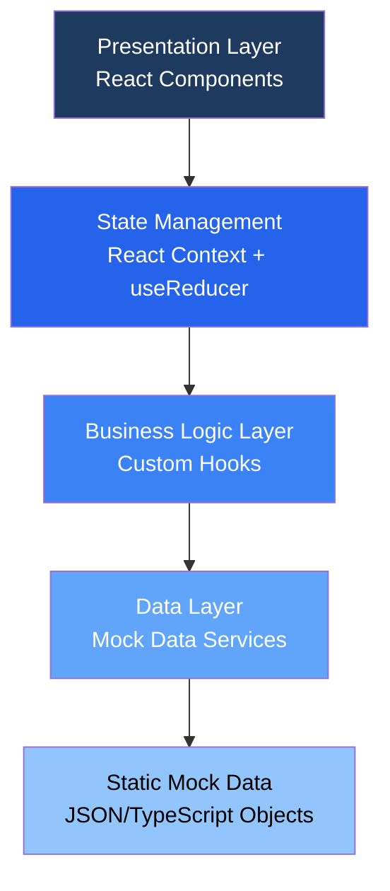
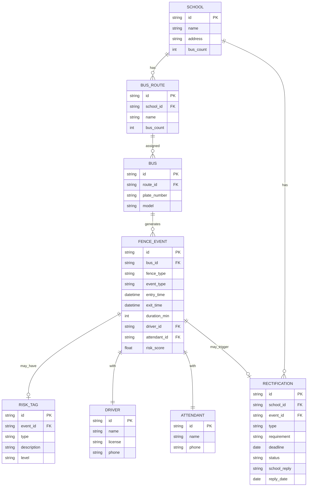

## 1. 架构设计

本项目为桌面端单页应用，采用前端React技术栈，内置Mock数据模拟后端接口，无需真实后端服务即可完整演示功能。



## 2. 技术描述

- **前端框架**：React@18.2.0 + TypeScript@5
- **构建工具**：Vite@5
- **样式方案**：TailwindCSS@3.4
- **路由管理**：React Router@6
- **状态管理**：React Context + useReducer（轻量级方案，避免过度设计）
- **图标库**：Lucide React
- **日期处理**：date-fns
- **UI组件基础**：Headless UI（提供无样式可访问组件）
- **数据模拟**：内置TypeScript Mock数据，无需后端
- **桌面打包**：Electron（可选，用于桌面端发布）

## 3. 目录结构

```
src/
├── components/          # 可复用组件
│   ├── layout/         # 布局组件（Sidebar、Header）
│   ├── ui/             # 基础UI组件（Button、Card、Badge等）
│   └── features/       # 业务组件
├── pages/              # 页面组件
│   ├── SchoolList/
│   ├── RiskInspection/
│   └── Rectification/
├── hooks/              # 自定义Hooks
├── context/            # React Context
├── types/              # TypeScript类型定义
├── data/               # Mock数据
├── utils/              # 工具函数
├── App.tsx
├── main.tsx
└── index.css
```

## 4. 路由定义

| 路由 | 页面 | 用途 |
|------|------|------|
| / | 学校清单 | 默认首页，展示学校列表和数据汇总 |
| /schools | 学校清单 | 学校列表、筛选、线路数据汇总 |
| /risk-inspection | 风险抽查 | 风险片段列表、事件详情、整改生成 |
| /rectification | 整改跟踪 | 整改列表、到期提醒、状态管理 |

## 5. 数据模型

### 5.1 实体关系图



### 5.2 核心类型定义

```typescript
// 围栏类型
type FenceType = 'school' | 'pickup' | 'danger';

// 事件类型
type EventType = 'entry' | 'exit' | 'missed' | 'detour';

// 风险等级
type RiskLevel = 'low' | 'medium' | 'high' | 'critical';

// 风险标签类型
type RiskTagType = 'frequent_detour' | 'off_site_boarding' | 'night_movement' 
  | 'long_stay' | 'missing_entry' | 'missing_exit';

// 整改状态
type RectificationStatus = 'pending' | 'replied' | 'completed' | 'overdue' | 'rejected';

// 整改类型
type RectificationType = 'explain' | 'supplement_record' | 'revalidate_site';

interface School {
  id: string;
  name: string;
  address: string;
  busCount: number;
  routeCount: number;
  latestRiskTags: RiskTagType[];
}

interface FenceSummary {
  schoolId: string;
  routeId: string;
  routeName: string;
  busCount: number;
  schoolFenceCount: number;
  pickupFenceCount: number;
  dangerFenceCount: number;
  abnormalCount: number;
  riskTags: RiskTagType[];
}

interface FenceEvent {
  id: string;
  busId: string;
  busPlate: string;
  routeId: string;
  routeName: string;
  fenceType: FenceType;
  fenceName: string;
  eventType: EventType;
  entryTime: Date;
  exitTime: Date | null;
  durationMin: number;
  driver: Person;
  attendant: Person;
  riskScore: number;
  riskLevel: RiskLevel;
  riskTags: RiskTag[];
}

interface RiskTag {
  type: RiskTagType;
  description: string;
  level: RiskLevel;
}

interface Person {
  id: string;
  name: string;
  phone: string;
}

interface Rectification {
  id: string;
  schoolId: string;
  schoolName: string;
  eventId: string;
  eventDescription: string;
  type: RectificationType;
  requirement: string;
  createdAt: Date;
  deadline: Date;
  status: RectificationStatus;
  schoolReply?: string;
  replyDate?: Date;
}
```

## 6. 状态管理

### 6.1 App State 结构

```typescript
interface AppState {
  filters: {
    selectedSchoolId: string | null;
    dateRange: { start: Date; end: Date };
    routeId: string | null;
    riskLevel: RiskLevel | null;
  };
  schools: School[];
  fenceSummaries: FenceSummary[];
  riskEvents: FenceEvent[];
  rectifications: Rectification[];
  selectedEvent: FenceEvent | null;
  ui: {
    isLoading: boolean;
    showRectificationModal: boolean;
    showEventDetail: boolean;
  };
}
```

### 6.2 核心Actions

- `SET_FILTERS` - 更新筛选条件
- `LOAD_FENCE_SUMMARIES` - 加载围栏数据汇总
- `LOAD_RISK_EVENTS` - 加载风险事件
- `SELECT_EVENT` - 选择查看事件详情
- `CREATE_RECTIFICATION` - 创建整改事项
- `UPDATE_RECTIFICATION_STATUS` - 更新整改状态
- `LOAD_RECTIFICATIONS` - 加载整改列表

## 7. 风险评分算法

风险片段排序优先级计算：

```
风险评分 = 基础分 + 标签加成 + 时间权重

基础分：
- 学校围栏未进/未出: 40分
- 接送点围栏异常: 30分  
- 危险路段进入: 50分

标签加成：
- 频繁绕行: +20分
- 站点外上下车: +25分
- 夜间异常移动: +30分
- 长时间停留: +15分

时间权重：
- 3天内事件: ×1.5
- 7天内事件: ×1.2
- 30天内事件: ×1.0
```
